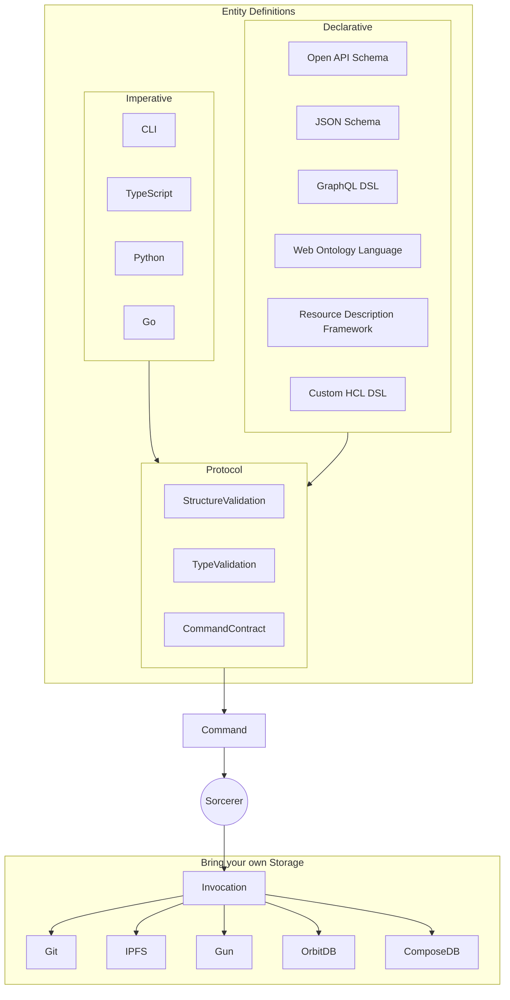

## Sorcerer 🪄


`sorcerer`[^1] is a fluent headless KMS framework designed for web3 and developer experience ([DX](https://medium.com/swlh/what-is-dx-developer-experience-401a0e44a9d9)) that enables you to describe any data entity as a reusable definition in a simple, zero-config manner without the need for a schema. `sorcerer` accomplishes this by translating schema into a configuration problem, and then managing it as [configuration as data](https://github.com/GoogleContainerTools/kpt/blob/main/docs/design-docs/06-config-as-data.md) that can be imported from multiple sources (e.g. OpenAPI/JSON Schema), and persisted in terms of 3 key abstractions: **attributes**, **components** and **commands**. 

[^1]:  Sorcerer is an idea under development and currently represents an open-source product vision. Any specifics about implementation are subject to pivoting, including (and especially) currently identified patterns that may have not been implemented or revised.

These abstractions are wrapped by a framework to facilitate the creation of predictable [fluent interfaces](https://en.wikipedia.org/wiki/Fluent_interface) to create semantic data.

All this so that you can focus on creating portable, historic, structured, type-safe entities from evolving definitions that can express any amount of attributes and components.

Well-defined data becomes useful as an emergent sysstemic property from the network by being reusable. The more referenced a piece of data becomes the more reliable and trust-worthy it can be considered, becoming trusted [knowledge](https://datarob.com/information-vs-data-vs-knowledge/).

### Usage

#### Use Cases

##### **Developers**

- Easily creating a config file for your app and export it's schema to OpenAPI
- Define all the entities in a video game to the degree of detail a mechanical CAD could

##### Humans

- A to-do list for your family
- Notes that synchronize between devices

#####  Organizations

- A headless tech radar
- A headless document vault

#### Examples

```shell
# Create a project
sorcerer conjuration --name "Middle Earth Epic" --gateway="git"

# Declare Person
sorcerer conjure entity \
	--name="Person" \
	--attributes.name=string,nn,uq \ #Validation hooks 
	--attributes.email=string

# Learn Vehicle
sorcerer learn --openapi=Vehicle.yaml

# Create reference from Vehicle to Person
sorcerer tether [Person] \           # Default cardinality is N..N
	[ --entity="Vehicle" ] \         # Explicit entity reference
	[ --attribute="uuid" ] \         # Explicit attribute reference
		[ --with-entity="Person" ] \ # In lieu of 1st/only positional argument
		[ --with-entity-attribute="uuid" ] # uuid is default fk 
		[ --cardinality="n..n" ]     # Creates a pivot, default cardinality

# Create a couple of dudes
sorcerer cast Person
	--name="Gandalf"
	--email="gandalf@middle.earth"

sorcerer cast Person
	--name="Gimli"
	--email="gimli@middle.earth"

# Represent relationships
sorcerer cast Vehicle
	--name="Shadowfax"
	--make="Mearas"
	--model="Male"
	--year="1989"

# Refactor your entity
sorcerer conjure entity \
	--name "Email" \
	--attributes.address=string,regex('^[\w-\.]+@([\w-]+\.)+[\w-]{2,4}$'),uq

sorcerer banish \
	--entity="Person"
	--attributes.email
# Share your data
sorcerer invoke \
	[ --target local ]
	--target git+ssh://git@github.com/<user>/<repo>

```


### Architecture

Instead of requiring a schema definition, `sorcerer` uses 3 key abstractions: attributes, components and commands, which can be understood through these architectural patterns:

- **Attributes**: Implemented using the **Entity Attribute Value ([EAV](https://en.wikipedia.org/wiki/Entity%E2%80%93attribute%E2%80%93value_model))** pattern which is enabling you to bring your own storage (BYOS) by abstracting columns and properties
  
- **Components**: **Entity Component System ([ECS](https://en.wikipedia.org/wiki/Entity_component_system))**: [Used in game development](https://docs.unity3d.com/Packages/com.unity.entities@0.1/manual/ecs_core.html), to describe complex objects and their interaction with the world (system).
  
- **Commands**: To abstract the interface implementation from the logic and storage while enable implementation of operation-based CRDTs (e.g. Y.js), storage-agnostic, historic state management, etc.
  
- **[Content-addressability](https://en.wikipedia.org/wiki/Content-addressable_storage)**: leveraging the wide but insconspicuous adoption of these inherently distributed technologies
	- **[UUIDs](https://en.wikipedia.org/wiki/Universally_unique_identifier)**
	- **[Magnet URI Schemes](https://en.wikipedia.org/wiki/Magnet_URI_scheme)**
	- [Backlinks](https://en.wikipedia.org/wiki/Backlink)

- Snandards-based: `sorcerer` allows you to ingest a schema definition to create instances ofany type of data entity to then create [uniquely identifiable](https://en.wikipedia.org/wiki/Universally_unique_identifier) content-adressable records aligned with the [principles behiind Open Data](https://opendatahandbook.org/guide/en/what-is-open-data/):

> *- **Availability and Access:** the data must be available as a whole and at no more than a reasonable reproduction cost, preferably by downloading over the internet. The data must also be available in a convenient and modifiable form.
> 
> -   **Re-use and Redistribution:** the data must be provided under terms that permit re-use and redistribution including the intermixing with other datasets.
>   
> -   **Universal Participation:** everyone must be able to use, re-use and redistribute - there should be no discrimination against fields of endeavour or against persons or groups. For example, ‘non-commercial’ restrictions that would prevent ‘commercial’ use, or restrictions of use for certain purposes (e.g. only in education), are not allowed.*

To achieve this, `sorcerer` focuses on distributed systems and technologies such as [Git](https://git-scm.com/), [IPFS](https://github.com/ipfs/ipfs) and [IPLD](https://ipld.io/).

### Features

#### Less is more

- **Server-less**: No need for external dependencies. No need to configure anything. No requests
- **Cloud-less**: That includes servers from Google, Amazon, Microsoft...
- **Daemon-less**: No need for running services that crash or run out of memory.
- **Schema-less**: Feeling imperative?, use the CLI. Already have a schema?, understand it with `sourcerer learn`, browse entities you know with `sorcerer remember`. 
- **Permission-less**: WIP 
- **Trust-less**: WIP
- **Backup-less**: everything is replicated all the time, just declare a peer.

#### DX and UX centric

Developers, developers, developers. But users too.

- **Fun**: Also called productivity.
- **Flat learning curve**: Fluent CLI design with shell autocomplete.
- **Universally P2P**: serving as a broker of standardized addressing systems and data contract standards.
- **Distributed**: No requirement for servers, no single point of falure, no single target.
- **Local-first**: Users own what they create.
- **BYOS**: Not even the implementation of `sorcerer` is tied to a single backend.

#### Usable

Instant utility out of the box, no need for manual:

- Zero-config 
- Platform-agnostic 
- Composable Entity Definitions
- Transformation plugins for importing/exporting between standard schemas and protocols

#### Local nformation Database

- Auditable: historical values are kept at the node of origin.
- Journaling: All actions are recorded to be able to reconstruct the final state of  the data.
- Garbage Isolation: As opposed to deleting unused data, `sorcerer` isolates the local records that have not been referenced by external peers are obsoleted after a given expiration
- Universal access: using magnet URLs

#### Distributed knowledge graph

- **Data Deduplication**: Being content adressable, data is coalesced in distributed cohorts when caches expire.
- **Single Source of Truth Traceability**: As data coalesces, every repested version becomes a backup, and records for the same entity become a single distributed redundant repository. 

## How it works




